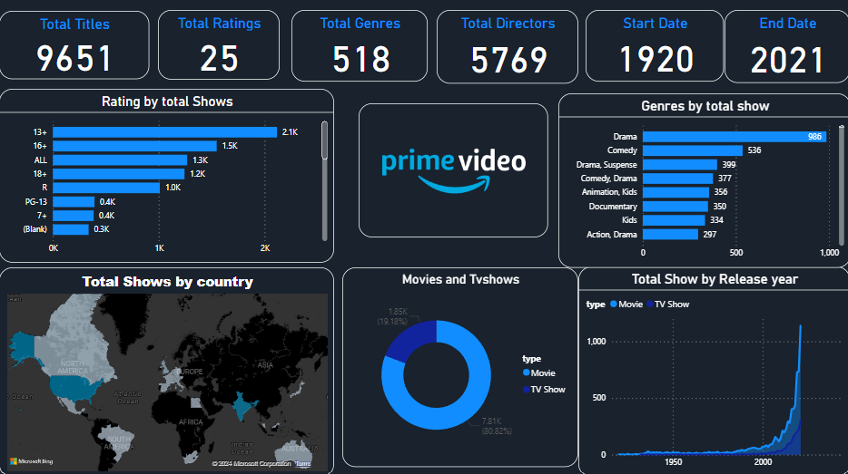

# Amazon Prime Video Dashboard Analysis

## Description
This project aims to analyze the content available on Amazon Prime Video using a Power BI dashboard. The dashboard provides visualizations showcasing various aspects of the content library, including distribution by country, movies vs TV shows, release years, ratings, and genres.

## Installation
1. Clone this repository to your local machine.
2. Open the Power BI file (`Amazon_Prime_Video_Dashboard.pbix`) using Power BI Desktop.
3. Ensure that you have access to the necessary data sources (Amazon Prime Video content data).
4. If needed, update the data connections in Power BI to point to your data sources.
5. Customize the dashboard as per your preferences.

## Usage
1. Open the Power BI file (`Amazon_Prime_Video_Dashboard.pbix`) using Power BI Desktop.
2. Navigate through the different tabs and visualizations to explore the Amazon Prime Video content analysis.
3. Interact with the visuals (e.g., filters, slicers) to drill down into specific aspects of the analysis.
4. Gain insights into content distribution by country, types of content (movies vs TV shows), release years, ratings, and genres.
5. Use the insights to inform content strategy, licensing decisions, and user preferences.

## Visualizations
### 1. Content Distribution by Country
- Map visualization showing the distribution of content available on Amazon Prime Video across different countries.

### 2. Movies and TV Shows Distribution
- Pie chart illustrating the proportion of movies versus TV shows in the content library.

### 3. Total Shows by Release Year
- Bar chart displaying the distribution of content based on the year of release.

### 4. Rating Distribution
- Histogram showing the distribution of content ratings, allowing users to understand the overall rating distribution.

### 5. Genres Distribution
- Treemap visualization depicting the distribution of content genres, providing insights into the variety of genres available.

## Live Dashboard
You can access the live dashboard [here](https://app.powerbi.com/groups/me/reports/76161b56-42a3-4b43-a670-eff9c12981a2/ReportSection?experience=power-bi).

## Dashboard Image

## License
This project is licensed under the [Your License] License - see the [LICENSE](LICENSE) file for details.

## Contributing
1. Fork the repository.
2. Create a new branch (`git checkout -b feature/your-feature-name`).
3. Make your changes.
4. Commit your changes (`git commit -am 'Add some feature'`).
5. Push to the branch (`git push origin feature/your-feature-name`).
6. Create a new Pull Request.
